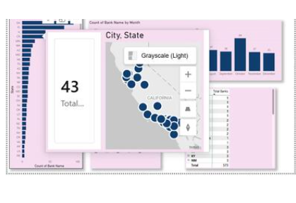

# Power BI Dashboard Design (Training Example)

## Overview
This project demonstrates dashboard design, data modeling, and visualization principles
using instructional and sample data in Power BI. The focus is on layout, usability,
and presenting information clearly for decision‑ready consumption.

No proprietary, employer, or internal data is included.

---

## Data
The data used in this project is instructional/sample data provided for training
purposes and dashboard design practice.

---

## Approach
This project emphasizes:
- Data modeling suitable for reporting
- Clear KPI presentation
- Visual hierarchy and layout
- Geographic and categorical breakdowns
- Designing dashboards that are easy to interpret

The focus is on communication and clarity rather than advanced calculations
or optimization.

---

## Sample Dashboard

---

## Tools Used
- Power BI (Dashboard design and visualization)

---

## Notes
This repository is intended for demonstration purposes only and reflects my
approach to analytics presentation, dashboard structure, and visual design
using non‑proprietary data.
